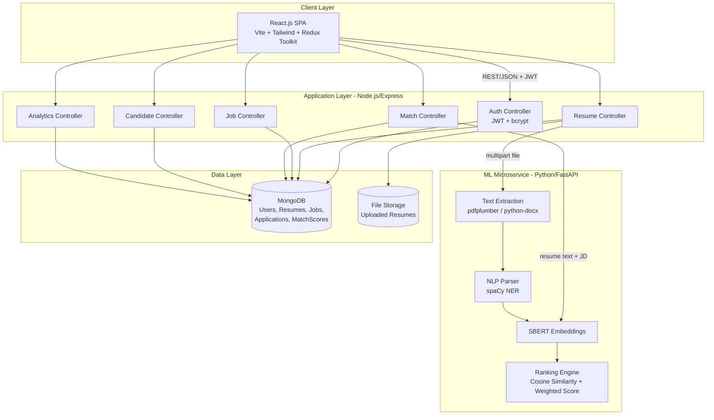
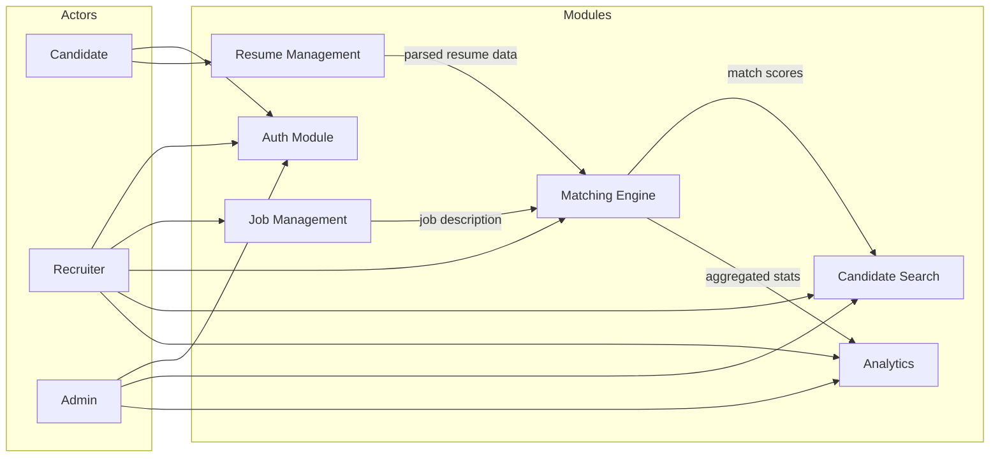

# 04. System Architecture, High-Level & Low-Level Design

## 1. System Architecture (Three-Tier + ML Microservice)



## 2. High-Level Design (HLD)



## 3. Low-Level Design (LLD) — Matching Pipeline Sequence

```mermaid
flowchart TD
    Start([Recruiter clicks "Run AI Matching"]) --> A[POST /api/matches/run/:jobId]
    A --> B[Fetch Job by ID from MongoDB]
    B --> C[Fetch all parsed Resumes from MongoDB]
    C --> D[Build batch payload:<br/>JD text + required skills + min experience<br/>+ each resume's text/skills/experience/education]
    D --> E[POST /match-candidates to ML microservice]
    E --> F[ML: Encode JD with SBERT]
    F --> G[ML: Batch-encode all resume texts with SBERT]
    G --> H[ML: Cosine similarity JD vs each resume]
    H --> I[ML: Compute skill/experience/education sub-scores]
    I --> J[ML: Generate natural-language insight per candidate]
    J --> K[Return results array to Node backend]
    K --> L[Node: Apply composite weights, compute final_match_percentage]
    L --> M[Node: Sort descending, assign rank]
    M --> N[Node: Upsert MatchScore documents in MongoDB]
    N --> O[Return ranked list to frontend]
    O --> End([Recruiter Dashboard renders ranked candidates])
```

## 4. Folder Structure

```
resume-screening-system/
├── backend/                     # Node.js + Express REST API
│   ├── config/db.js
│   ├── models/                  # Mongoose schemas (7 collections)
│   ├── controllers/             # Business logic per resource
│   ├── routes/                  # Express routers
│   ├── middleware/               # auth, error handling, file upload
│   ├── utils/generateToken.js
│   ├── server.js
│   └── package.json
│
├── ml-service/                  # Python + FastAPI NLP/ML microservice
│   ├── app/
│   │   ├── text_extraction.py
│   │   ├── resume_parser.py
│   │   ├── embeddings.py
│   │   ├── ranking.py
│   │   ├── skills_db.py
│   │   └── schemas.py
│   ├── main.py
│   └── requirements.txt
│
├── frontend/                    # React.js + Vite + Tailwind + Redux Toolkit
│   ├── src/
│   │   ├── pages/                (Login, Register, Dashboards, Upload, Analytics...)
│   │   ├── components/           (Navbar, Sidebar, DashboardCard, DataTable...)
│   │   ├── layouts/DashboardLayout.jsx
│   │   ├── redux/{store.js, slices/}
│   │   ├── services/api.js
│   │   ├── App.jsx
│   │   └── main.jsx
│   ├── index.html
│   └── package.json
│
└── docs/                        # This documentation set
```
