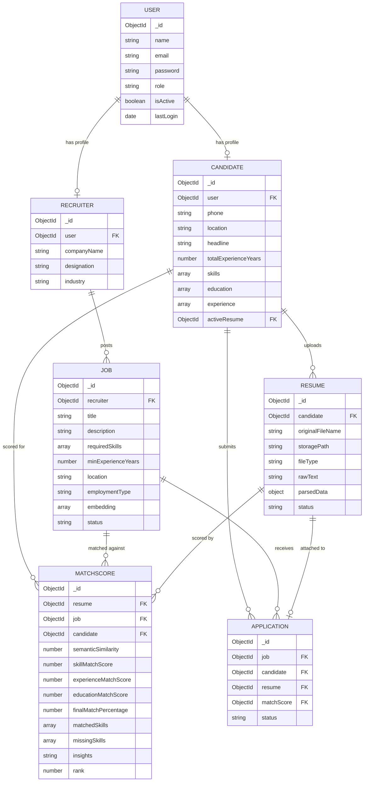
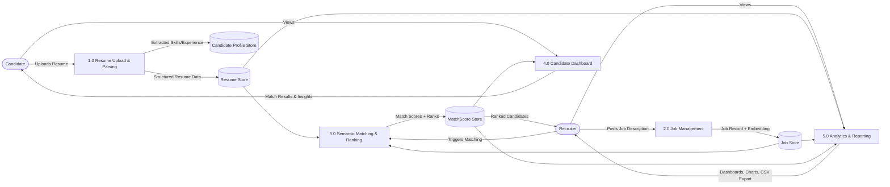
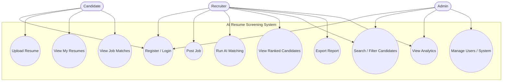
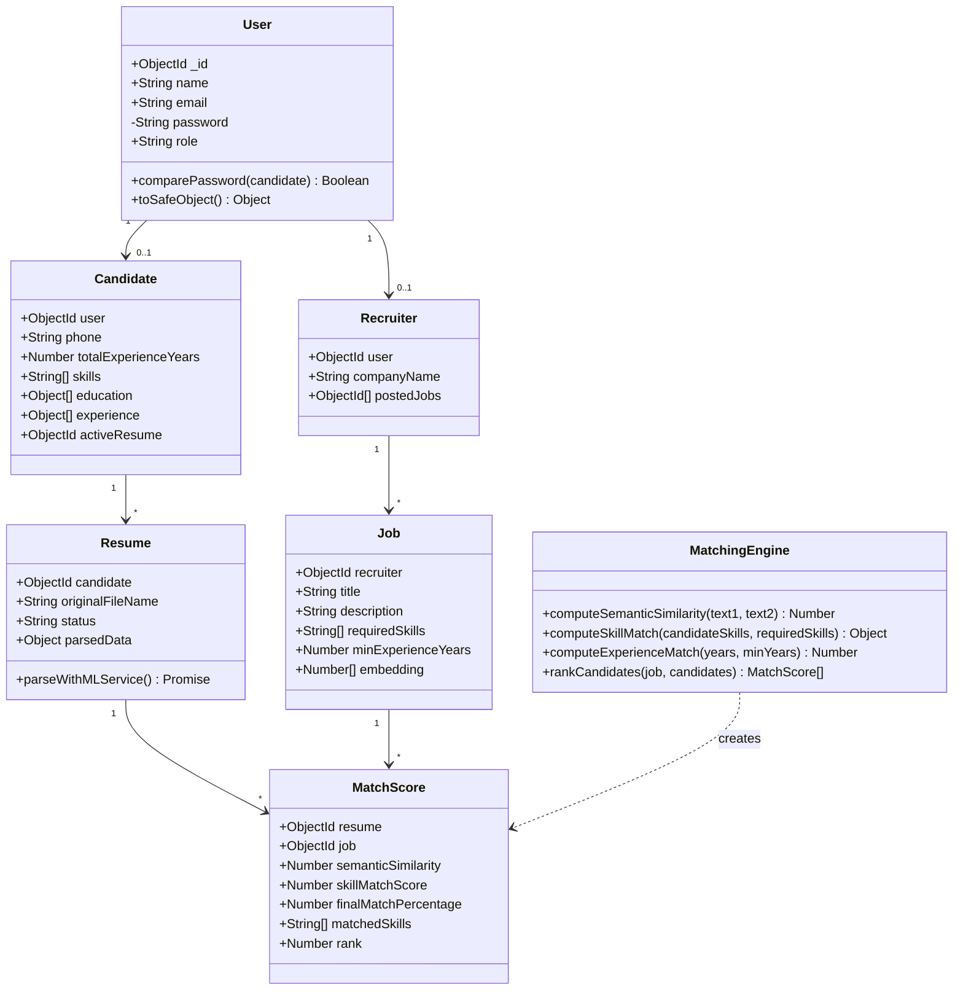
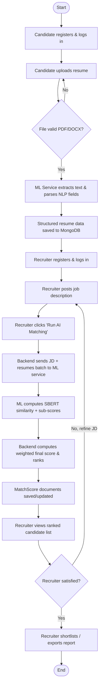

# 05. ER Diagram, Data Flow Diagram, Use Case, Class & Activity Diagrams

## 1. Entity-Relationship (ER) Diagram

## 2. Data Flow Diagram (DFD) — Level 1

## 3. Use Case Diagram

## 4. Class Diagram (Core Domain Model)

## 5. Activity Diagram — End-to-End Matching Flow

